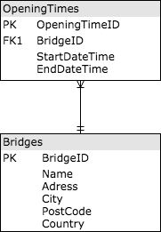

[](https://travis-ci.org/jesperancinha/bridge-logistics)
[](https://www.codacy.com/app/jofisaes/bridge-logistics?utm_source=github.com&amp;utm_medium=referral&amp;utm_content=jesperancinha/bridge-logistics&amp;utm_campaign=Badge_Grade)
[](https://circleci.com/gh/jesperancinha/bridge-logistics)
[](https://codebeat.co/projects/github-com-jesperancinha-bridge-logistics-master)
[](https://bettercodehub.com/)

[](#)
[](#)
[](#)

# Bridge Management Logistics

Starting from the example of [Michel Schudel](https://github.com/MichelSchudel), this is an application to be build using a JMS messaging system to serve the logistics for a bridge management system.  
If you look at the first [brick](https://github.com/jesperancinha/bridge-logistics/blob/master/bridge-logistics-jms/src/main/java/com/jesperancinha/bridgelogistics/services/BridgeOpeningService.java) of this project, you can see that the whole project involves managing timetables as a kick-start.
The project will be expanded to further goals.  

Current goal is to use ActiveMQ as a JMS provider. 
JMS provider will play following roles:

1.   Count passengers going through a bridge
2.   Register transport type
3.   Register merchandise before crossing the bridge
4.   Register events per configured range area

Passengers are registered by numbers and if they they carry extra merchandise or a bike
Transport can be a train, bus, boat, bike, truck, etc.
Merchandise should registered if it's destined to commercial exchanges.
Events can be anything that may happen in a configured range around the bridge

For passengers, a development area will be created called PCS(Passenger Control Service).  
For merchandise, a development area will be created called MCS(Merchandise Control Service).  
For bridge ranges, a development area will be created called DCS(Domain Control Service).  

## Overview



## Status 

**Under development**


## Docker installation

### Install VirtualBox

Option 1

>$ brew tap caskroom/cask  
>$ brew install brew-cask-completion  
>$ brew install brew-cask  
>$ brew cask install virtualbox  
 
Option 2

Go to: [Download VirtualBox](https://www.virtualbox.org/wiki/Downloads)  

You might need this:

>$ sudo spctl --master-enable


### Install Docker machine

Option 1

>$ brew cask install docker
>$ docker-machine create dev

Option 2

Go to: [Install Docker Desktop for Mac](https://docs.docker.com/docker-for-mac/install/)

### Start Docker

>$ docker build --rm=true -t bridge-logistics-image .

>$ docker run -i -t -d -p 5432:5432 bridge-logistics-image

>$ docker container ls --all

## Location

[GitHub location](https://github.com/jesperancinha/brugdemo)

## Sources

-   [Brug Demo](https://github.com/MichelSchudel/brugdemo)
-   [JMS vs RabbitMQ](https://dzone.com/articles/jms-vs-rabbitmq)
-   [Get Started with RabbitMQ](https://www.rabbitmq.com/getstarted.html)
-   [Microservice Architecture by Kong](https://microservices.io/)
-   [Integrate ActiveMQ with WildFly](http://www.mastertheboss.com/jboss-server/jboss-jms/integrate-activemq-with-wildfly)
-   [SQL Server Table and Column Naming Conventions](https://www.codeproject.com/Articles/1065295/SQL-Server-Table-and-Column-Naming-Conventions)
-   [The Power of a Good SQL Naming Convention](https://www.xaprb.com/blog/2008/10/26/the-power-of-a-good-sql-naming-convention/)
-   [Integration Testing for Java EE](https://www.oracle.com/technetwork/articles/java/integrationtesting-487452.html)
-   [How to create Docker Images with a Dockerfile](https://www.howtoforge.com/tutorial/how-to-create-docker-images-with-dockerfile/)
-   [How to create a Docker image for PostgreSQL and persist data](https://www.andreagrandi.it/2015/02/21/how-to-create-a-docker-image-for-postgresql-and-persist-data/)
-   [Dockerize PostgreSQL](https://docs.docker.com/engine/examples/postgresql_service/)

## Requirements Change log

2019/06/13:
-   Rest services implementation foundations
-   Module separation

2019/06/12:
-   Automatic PostgreSQL table generation via JEE8 and the Java Persistence API
-   Docker file

2019/06/10:
-   Migration to Java 11
-   Docker foundations

2019/06/06:
-   Main entities created
-   Introduction of Lombok

2019/06/05:
-   Design stages

2019/06/04:
-   First successful implementation of the JMS topics with ActiveMQ
-   Connection from Wildfly to local ActiveMQ

2019/06/03:   
-   Switch to ActiveMQ  

2019/06/02:
-   MDB's deployed
-   Foundations for Web application
-   First PassengerConsumer JMS Topic listener
-   Introduction of JMS provider
-   Introduction of RabbitMQ
-   JEE8 introduced
-   Requirements expansion

2019/06/01:
-   Product modularization
-   Records timetables per bridge name
-   Generates conflict table by key opening time
-   Orders opening times by opening time

2019/05/31:
-   Adds automated code QA tests
-   Changes code from dutch to english
-   AssertJ for unit tests
-   Groups by conflictual bridge opening
-   Groups by Bridge

## Tools

-   [SDKMAN!](https://sdkman.io/install)

## License

```text
Copyright 2016-2019 João Esperancinha (jesperancinha)

Licensed under the Apache License, Version 2.0 (the "License");
you may not use this file except in compliance with the License.
You may obtain a copy of the License at

   http://www.apache.org/licenses/LICENSE-2.0

Unless required by applicable law or agreed to in writing, software
distributed under the License is distributed on an "AS IS" BASIS,
WITHOUT WARRANTIES OR CONDITIONS OF ANY KIND, either express or implied.
See the License for the specific language governing permissions and
limitations under the License.
```

## About me

-   [](http://joaofilipesabinoesperancinha.nl)

-   [](https://twitter.com/intent/follow?screen_name=jofisaes)

-   [](https://github.com/jesperancinha)

-   Free Code Camp [jofisaes](https://www.freecodecamp.org/jofisaes)

-   Hackerrank [jofisaes](https://www.hackerrank.com/jofisaes)

-   Acclaim Badges [joao-esperancinha](https://www.youracclaim.com/users/joao-esperancinha/badges)

---

-   Projects:

    -   [](http://tds.joaofilipesabinoesperancinha.nl/)
    -   [](http://itf.joaofilipesabinoesperancinha.nl/)
    -   [](http://mancalaje.joaofilipesabinoesperancinha.nl/)
    -   [](https://play.google.com/store/apps/developer?id=Joao+Filipe+Sabino+Esperancinha)
---

-   [](https://github.com/JEsperancinhaOrg)

    -   [](https://github.com/JEsperancinhaOrg/itf-chartizate-android)[](https://search.maven.org/search?q=itf.itf-chartizate-android)[](https://bintray.com/jesperancinha/maven/itf-chartizate-android/_latestVersion)[](https://github.com/JEsperancinhaOrg/itf-chartizate-android/releases)
    -   [](https://github.com/JEsperancinhaOrg/itf-chartizate-modules/tree/master/itf-chartizate-java)[](https://search.maven.org/search?q=itf.itf-chartizate-java)[](https://github.com/JEsperancinha/itf-chartizate-modules/releases)
    -   [](https://github.com/JEsperancinhaOrg/itf-chartizate/tree/master/itf-chartizate-api)[](https://search.maven.org/search?q=itf.itf-chartizate-api)[](https://github.com/JEsperancinhaOrg/itf-chartizate/releases)
    -   [](https://github.com/jesperancinha/markdowner/tree/master/markdowner-core)[](https://search.maven.org/search?q=parser.markdowner-core)[](https://github.com/jesperancinha/markdowner/releases)
    -   [](https://github.com/jesperancinha/markdowner/tree/master/markdowner-filter)[](https://search.maven.org/search?q=parser.markdowner-filter)[](https://github.com/jesperancinha/markdowner/releases)

-   Status page:
    -   [](https://github.com/jesperancinha/project-signer/blob/master/project-signer-templates/Status.md)

---

-   Badges:

[](https://www.youracclaim.com/badges/92e036f5-4e11-4cff-9935-3e62266d2074/public_url)
[](https://www.youracclaim.com/badges/a206436d-6fd8-4ca1-8feb-38a838446ee7/public_url)
[](https://www.youracclaim.com/badges/f4c6cc1e-cb52-432b-904d-36d266112225/public_url)
[](https://www.youracclaim.com/badges/8d27e38c-869d-4815-8df3-13762c642d64/public_url)
[](https://www.youracclaim.com/badges/4e26d062-6587-4bcf-b111-04f039318888/public_url)
[](https://www.youracclaim.com/badges/2471e6a1-05f9-40a1-9f13-92806875b690/public_url)
[](https://www.youracclaim.com/badges/11c9792f-3e3d-4d01-89e9-3a9c1567e76c/public_url)
[](https://www.youracclaim.com/badges/8de731f7-60f7-4fef-8748-5888168c76cb/public_url)
[](https://www.youracclaim.com/badges/ef84482b-c3cd-47d2-8d04-d3dd2b0c8aa3/public_url)
[](https://www.youracclaim.com/badges/3cedbc65-f74b-4d17-81a2-121f214f811f/public_url)
[](https://www.youracclaim.com/badges/d5de47d2-156c-4864-8605-13531b0df62e/public_url)
[](https://www.youracclaim.com/badges/d216b767-fe19-4e83-b54b-4e1ffd937111/public_url)
[](https://www.youracclaim.com/badges/3f7d55b3-b070-4fd1-a733-30c33c64e9a0/public_url)
[](https://www.youracclaim.com/badges/51deb903-266a-4cc6-a401-ea80a8aaaeaf/public_url)
[](https://www.youracclaim.com/badges/0a76635a-e612-4fee-9c44-ccfc54e02d77/public_url)
[](https://www.youracclaim.com/badges/4e19b1b7-034c-4406-ac36-0fcbe9c46db7/public_url)
[](https://www.youracclaim.com/badges/41c2b74c-668f-4d3a-a98c-8d6f5ce2757d/public_url)
